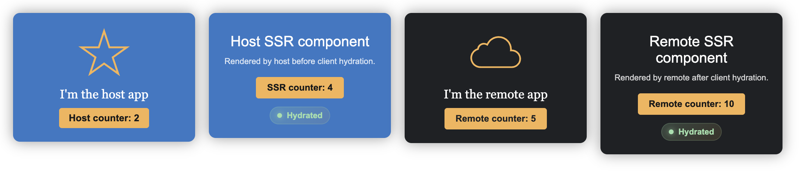

# Vinext SSR host, shared remote, and isolated island

This example covers both SSR composition strategies:

- `remote` declares React as shared and is rendered directly in the host React 19 tree.
- `island` opts in with `experiments: { ssrMode: "ISLAND" }` and does not share React, so the MF Vite plugin adds an island capability to its React expose. The host adapter renders it on the server and hydrates it with the remote's React 18 outside the React 19 tree.

The host loads both through Module Federation.

## Getting started

From this directory, run:

```sh
pnpm preview
```

Open http://localhost:4173/ in your browser.

The shared remote runs at http://localhost:4174 and the React 18 island at http://localhost:4175.

The exposed module keeps its original default component and receives an additional `__mf_island` property. A host opts into the plugin-provided React adapter with `import Counter from "island/Counter?mf-island"`; the generated server component renders the island HTML and its generated client boundary hydrates it. Importing `island/Counter` without the query remains unchanged, so a consumer can use `__mf_island` directly and implement a different adapter. The island contract is generic; Vinext is only the SSR host used by this example.


